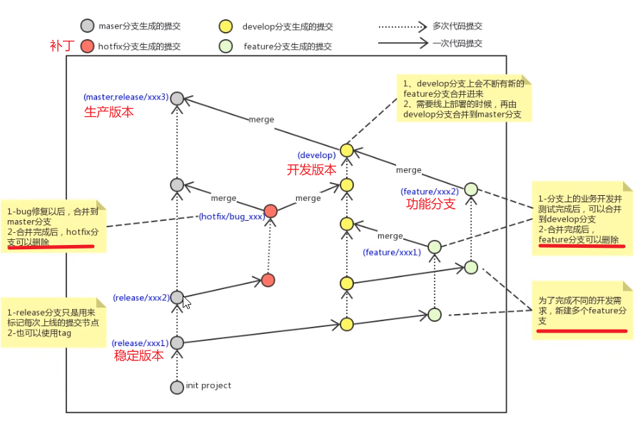
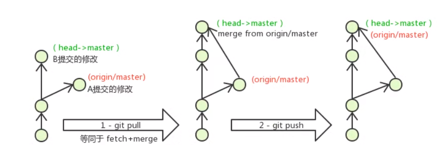

# 本地仓库

## 基础配置

### 设置名称和邮箱

```shell
git config --global user.name "名称"
git config --global user.email "你的邮箱"
在目录下打开gitbash
mkdir test # 创建目录
cd test #  进入目录
```

### 设置常用指令

```shell
用户目录创建 ~
touch ~/.bashrc

# 模拟登录过程
if [ -f ~/.profile ]; then
  . ~/.profile
fi
# 用于输出git提交日志
alias git-log='git log --pretty==oneline --all --graph --abbrev-commit'
# 用于输出当前目录所有的文件以及基本信息
alias ll='ls -al'
```

## 核心语句

### 创建.git

```shell
git init                  #  初始化.git
```

### 添加到暂存

```shell
git add test.c            #  添加到本地仓库缓存
git add .                 #  将所有修改加入暂存
```

### 取消暂存

```shell
git restore --stage .	  #  取消所有暂存
git restore --stage file  #  取消对应文件的暂存
```

### 提交暂存

```shell
git commit -m "add file"  #  提交和写注释 *`

git commit --amend        #  重写上一次包含注释和变更内容
```

### 查询状态

```shell
git status                # 查看文件信息
```

### 查询日志

```shell
git-log                   # 查看提交日志 git-log简洁日志
```

### 创建和切换分支

```shell
git checkout 分支          # 切换分支
git checkout -b 分支名     # 创建并切换分支
```

### 合并分支

```shell
git merge 分支名           # 先切到目标分支，在把修改分支合并过来
```

### 版本回退（回滚）

```shell
git reset --hard commitID # 提交的id
```

### 查看回退前的id

```shell
git reflog
```

## 其他命令

### 新建文件

```shell
touch test.c              # 新建文件
```

### 查看内容

```shell
cat test                  # 输出文件内容
```

### vi

```shell
# vi编辑 
1 insert 
2 this is a test 
3 esc 
4 :wq ctrl+c+y :q! # 退出并保存 退出不保存 强制退出不保存 
vi test                   
```

## 分支协同开发

`原则：我们只能对一个分支进行修改`

### 查看分支

```shell
git branch 
```

### 创建分支

```shell
git branch dev01
```

### 删除分支

```shell
git branch -d dev02
git branch -D dev02 # 强制删除
```

### 使用git branch -D dev02的场景

```shell
error: The branch 'dev02' is not fully merged.
If you are sure you want to delete it, run 'git branch -D dev02'.
提交过修改的分支没有合并过，如果确认删除使用git branch -D dev02
```

### *切换分支

```shell
git checkout dev01
git checkout -b dev02 # 创建并切换
```

### 当前分支

```shell
HEAD -> dev01  #head指向当前分支
```

`原则：一般自己创建分支合并到master分支上`

### 合并

```shell
1. git checkout master # 切换到主分支
2. git merge dev01 # 把dev01分支上的修改合并到master上
```

### Fast-forward快进模式

```
指不用重新提交直接进行合并
```

## 解决冲突

```shell
#1.出现冲突合并失败 -- 原因修改了同一个文件同一行
#2.修改文件会出现
<<<<<<< HEAD
update count = 3
=======
update count = 2
>>>>>>> dev
#这种格式，直接对文件进行修改即可,留下正确的内容
update count = 2
#暂存提交
3.add
4.commit
```

## 开发中分支规范

- master:生产分支，主分支，线上运行的应用对应的分支
- develop:开发分支：开发分支一般作为开发部门的主要分支，不删
- feature：功能分支，开发并测试完毕后，可以合并到develop分支后删除
- release:稳定版本，每次上线的提交节点
- hotfix：从release创建分支进行修改测，没问题后合并到master上解决bug,再提交到生产最后删除。
- pre：预上线分支
- test:测试分支



# 远程仓库

## SSH

> 推荐企业使用，配置私有的公钥私钥进行传输

```shell
#创建一个远程仓库

#生成SSH公钥 
ssh-keygen -t rsa
#不断回车
#如何公钥已经存在，则自动覆盖
#Gitee设置账户公钥

#获取公钥
cat ~/.ssh/id_rsa.pub

#验证公钥
ssh -T git@gitee.com

## 绑定远程仓库
git remote add origin https://gitee.com/WindLain/git.git

#其余操作跟https一致
```

## *Https

> 推荐个人使用，减少配置公私钥

### 绑定远程仓库

```
git remote add origin https://gitee.com/WindLain/git.git
```

### 查看远程仓库

```
git remote
```

### 代码推到远程仓库并且建立和远端分支的关联关系

```
git push --set-upstream 远程名称 本地仓库:远程仓库
git push --set-upstream origin master:master
```

### 查看本地分支和远程分支的绑定情况

```
git branch -vv
```

### 已有绑定关系推到远程

```
git push
```

### 代码推到远程仓库不建立关联关系

```
git push origin 本地：远程
git push origin master:master // 把本地的master推到远程master
git push origin master // 同名省略
```

### 有冲突强制覆盖，一般不用

```
git push -f origin master 
```

### 克隆仓库

```
git clone https://gitee.com/WindLain/git.git （指定名称）
```

### 从远程抓取

```
git fetch // 把远程分支抓到本地不进行合并
```

### 从远程拉取

```
git pull // 把远程分支抓到本地并进行合并
```

## 合并冲突问题



> A remote和B local同时对同个地方的代码进行修改

### git pull 拉取并合并

```
git pull 
git megre 分支
```

### 把冲突文件修改后

```
<<<<<<< HEAD
update count = 3
=======
update count = 2
>>>>>>> dev

update count = 2
```

### 进行暂存提交

```
git add 
git commit -m "solve"
```

### 然后推到远程

```
git push
```

